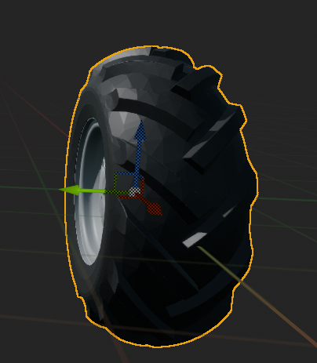
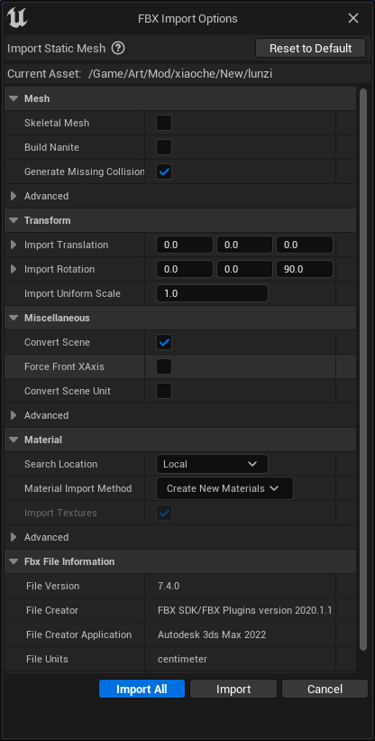
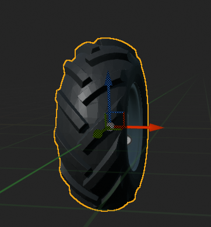

## 1.万向锁

在模拟小车轮子转动时，轮子刚好绕着Y轴转动，这刚好触发了欧拉角的万向锁问题，当轮子Y轴转到90度之后，就再也无法往下转动了。

在网上查了一下解决方案，大都是使用四元数来计算旋转角，但还是觉得麻烦了，于是想到，在导入模型的时候UE是支持给一个旋转量偏移的，于是在导入模型时我们可以给模型一个绕Z轴旋转90度的偏移量。

这样X轴就会转到Y轴的方向，于是轮子就可以不用绕Y轴转动，改绕X轴转动了，这样就能有效的避免绕Y轴转动的万向锁问题。

## 2.Widget播放多路视频卡顿

这次项目出现了打开19个视频源，并且同时播放6路视频，其中7个视频源为rtsp流媒体，12个视频源为本地视频，在这个过程中出现了播放视频卡顿的情况，在网上查了一下，解决视频播放卡顿的方法还不少，不同原因导致视频播放卡顿有不同的解决方案。

如果是因为视频分辨率高，码率高导致卡顿可以参考这篇文章：[UE在同时播放多个视频，卡，丢帧情况 解决方法 – 虚拟制片之路 (ggwp.cn)](https://www.ggwp.cn/519/)

而我因为打开视频源和播放的视频太多导致的卡顿，我们可以在`Project Settings/Plugins/IMG Media/Caching`下把Cache Size GB和Global Cache Size GB两个缓存设置得大一点，这样可以解除缓存限制。