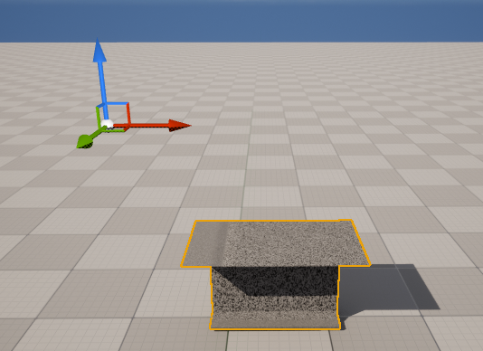
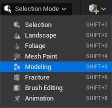
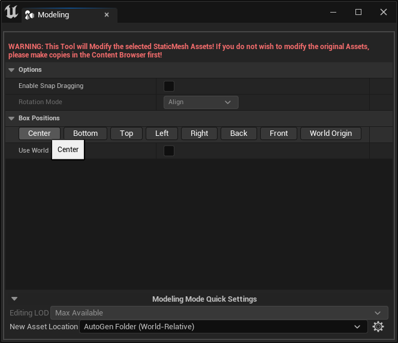
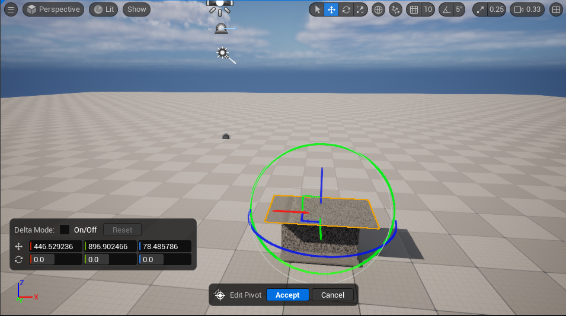
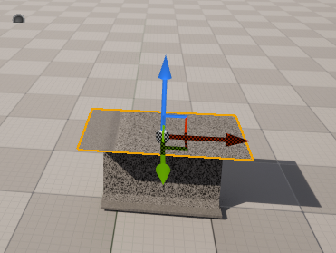

浙江移动项目

请先放置大文件

大文件详情请见BigFiles/BigFile.txt

## 重置模型坐标轴

有时我们导入到UE的模型坐标轴可能不在模型中心，而是在一个很远的地方，这种情况我们在使用模型时会出现很多不便，所以需要将模型的坐标中重置到模型中心，这个操作其实不需要返工到建模阶段去重置，其实UE自身就提供了这个功能。

方法就是切换UE的编辑器的编辑模式到模型编辑模式：

然后在Mode Toolbar视窗中选择Transform栏的Pivot选项，选择之后，到Modeling选项卡，点击Center按钮。

然后点击场景视图中的Accept应用变换，坐标轴就可以被重置到模型中心了：

这时我们再将编辑器切回选项模型，就可以看到坐标轴已经被重置到模型中心了：

