# 一、预览


# 二、部分实现

## 1.获取实时天气信息

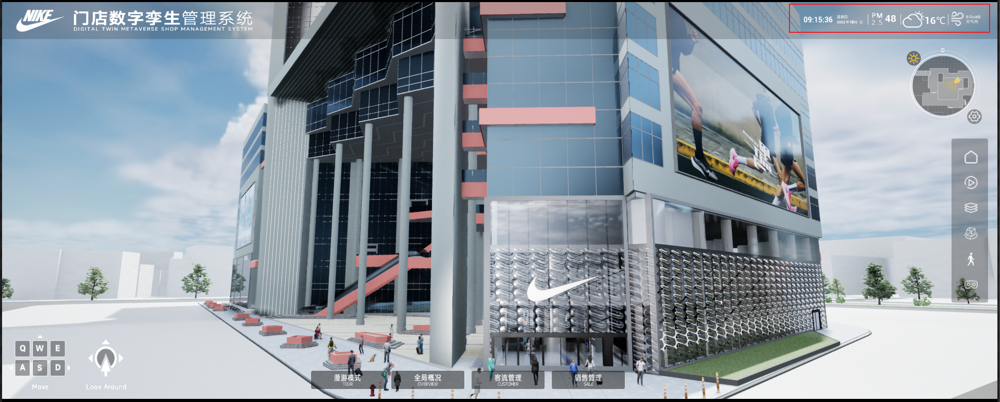

### 申请天气查询地址

这里主要是从高德地图中获取指定地点的天气信息，具体操作为：`浏览器搜索高德地图PAI->开发支持->Web服务API->天气查询->申请Key`

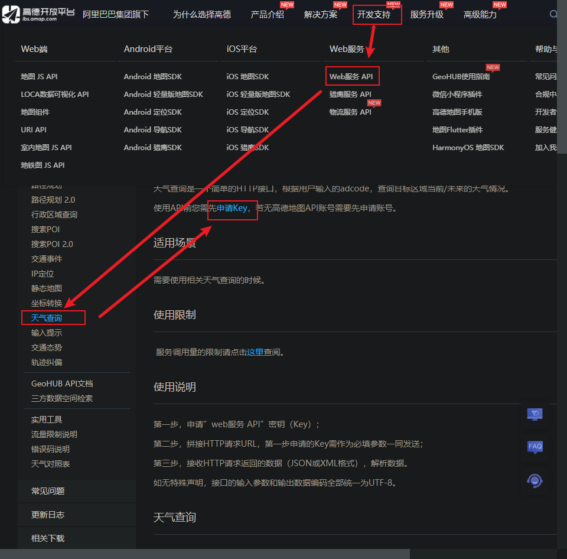

点击申请Key后会进入我的应用界面，点击添加，Key的名字可以自取，服务选择Web服务，然后提交就可以获得一个Key值。

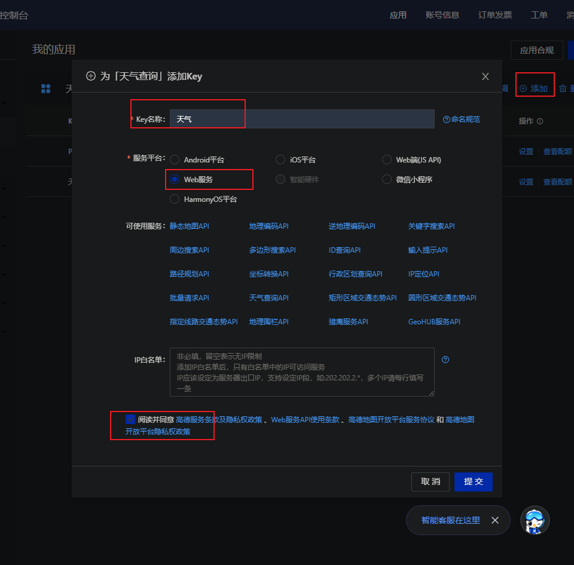

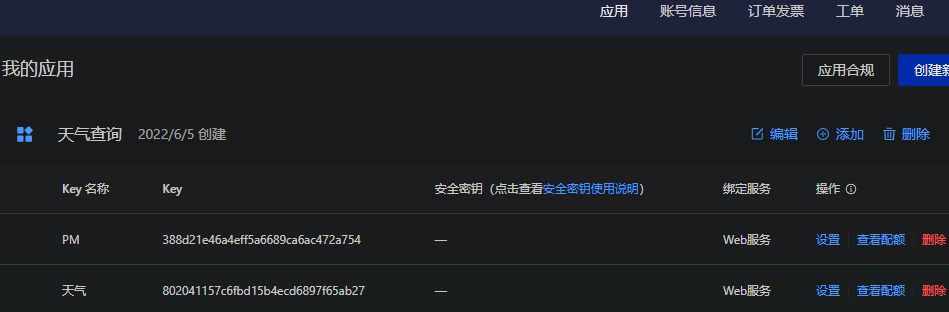

然后回到上一个页面，在`天气查询/请求参数`下可以下载城市编码表，获取想要的城市编码。然后按照`天气查询API服务地址`下给的URL格式组合请求链接，如：

```
https://restapi.amap.com/v3/weather/weatherInfo?key=802041157c6fbd15b4ecd6897f65ab27&city=310000
```

其中key=后面的编码就是我们申请的Key值，city=后面的数字就是城市编码，这样就可以通过这个地址获取到指定城市的实时天气信息了，可以在浏览器中检查一下：

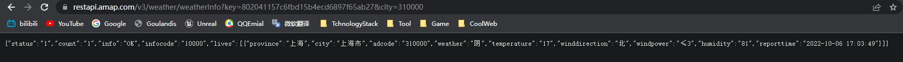

### 将信息链入UE4

这里需要用到VaRest插件，插件是免费的，可以直接到UE商城下载。

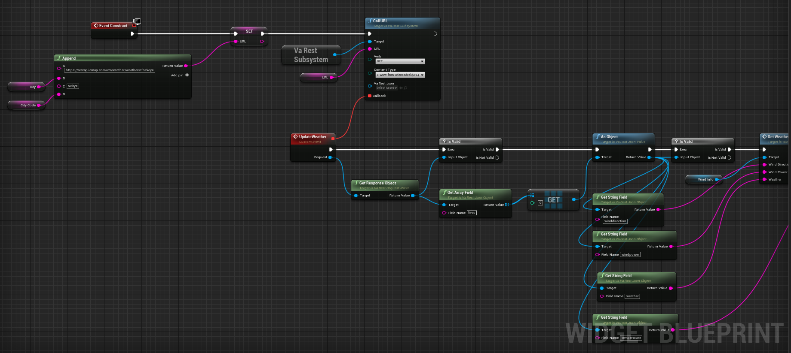

主要通过CallURL接口请求数据，请求到数据后会调用回调函数，并把取得的数据的Json对象，然后通过VaRest提供的接口，即可将数据解析出来。

## 2.建筑描边

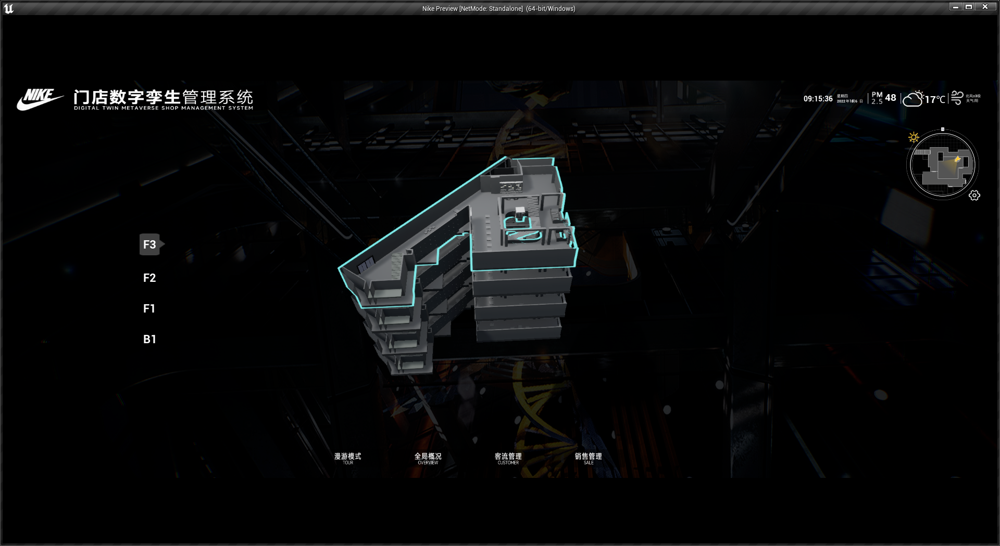

这里主要是使用后期盒子来实现描边效果，把需要描边的的物体勾选StaticMesh下的属性`Rendering/RenderCustomDepthPass`（我这里是使用蓝图动态设置的），然后把物体放入PostProcessVolume体积内，可以根据后期盒子是否需要影响全局勾选`PostProcessVolumeSettings/InfiniteExtent(Unbound)`，我这里没有勾选，因为勾选会影响到天空球，然后为后期盒子的`RenderingFeatures/PostProcessMaterials`属性设置材质，即可通过材质球修改表面的颜色了。

## 3.使用PaperFlipbook应用Widget动画

### 创建帧动画

我们知道UE为Widget提供了Animation系统，除此之外，Widget还可以使用PaperFlipbook的帧动画，效果如图：

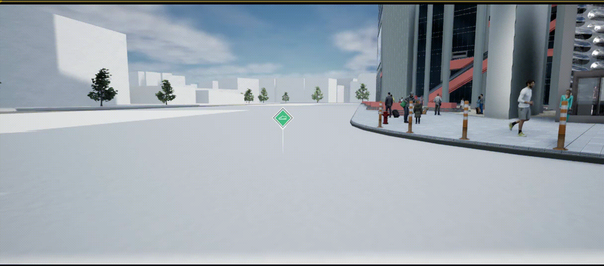

将每一帧的图片导入UE，并制作成Sprite，如：

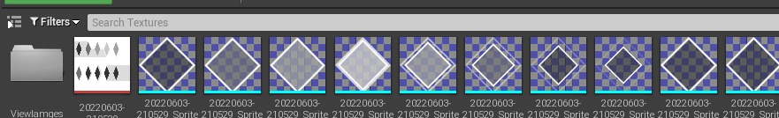

然后点击`Animation->PaperFlipbook`，在`Details/Sprite/KeyFrames`下按照自己想要的顺序添加Sprite并设置好每一帧的时长，于是帧动画就动起来了。

### 将帧动画应用到Widget

创建一个Widget，Widget结构也比较简单，一个是前景图，一个是背景帧动画：

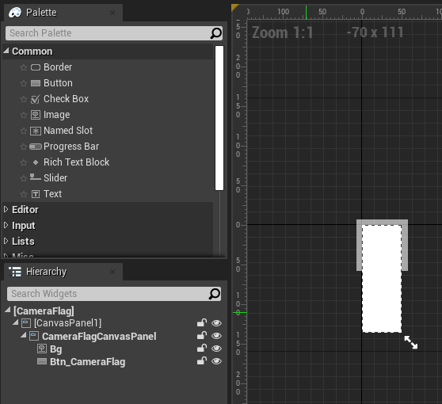

然后可以通过每一帧抽取PaperFlipbook的Sprite并设置到Image的Brush上的方式实现Widget的帧动画，具体蓝图如下：

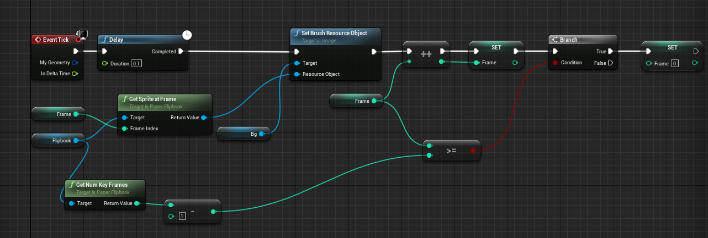

再把前景图设置好，就可以实现动图的效果了。
