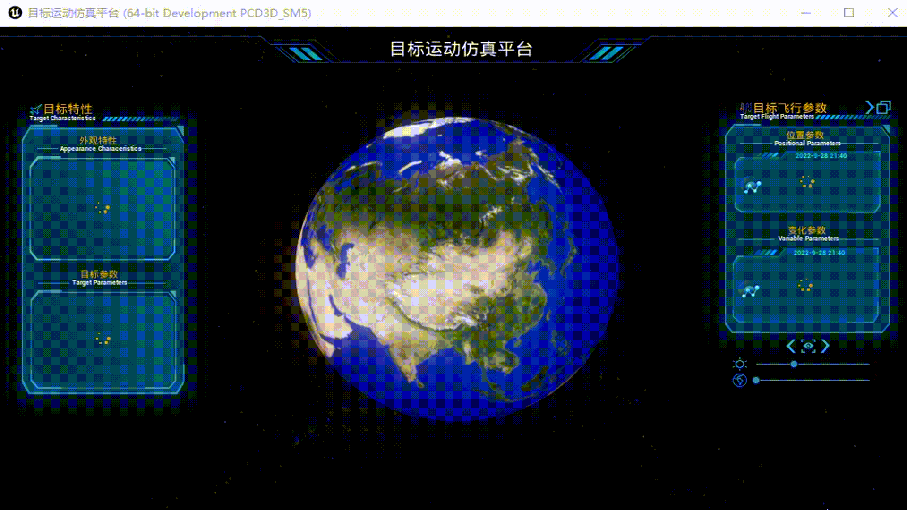

# 预览


# 部分技术实现

## 窗口关闭监听

项目有一个需求，就是关闭窗口时程序不直接关闭而是弹出确认框，确认后再关闭。这就需要对Windows窗体的关闭消息做拦截，对于Windows窗体UE也做了封装—SWindow，并且也对窗体的操作了做了监听，所以我们只需要将监听到关闭窗体要执行事件设置成自己的自定义事件即可。

我这里把窗体关闭的事件以代理的形式暴露给蓝图，并在蓝图中绑定执行事件

```c++
#include "CoreMinimal.h"
#include "Engine/GameInstance.h"
#include "FlightSimulatorGameInstance.generated.h"

DECLARE_DYNAMIC_MULTICAST_DELEGATE(FOnWindowClose);

UCLASS()
class FLIGHTSIMULATOR_API UFlightSimulatorGameInstance : public UGameInstance
{
	GENERATED_BODY()
public:
	UPROPERTY(BlueprintAssignable)
	FOnWindowClose OnWindowClose;
public:
	void OnExit(const TSharedRef<SWindow>& window);
};
```

```c++
#include "FlightSimulatorGameInstance.h"

void UFlightSimulatorGameInstance::OnExit(const TSharedRef<SWindow>& window)
{
    OnWindowClose.Broadcast();
}
```

最终要的更换监听事件的代码：

```c++
#include "Engine.h"
#include "../GamePlay/FlightSimulatorGameInstance.h"
#include "Widgets/SWindow.h"
#include "Engine/World.h"
//...
void UCommonFunLib::RequestDestroyWindowOverride()
{
    GEngine->GameViewport->GetWindow()->SetRequestDestroyWindowOverride(FRequestDestroyWindowOverride::CreateUObject((UFlightSimulatorGameInstance*)(GWorld->GetGameInstance()), &UFlightSimulatorGameInstance::OnExit));
}
```

然后再在蓝图中绑定自定义的执行事件即可，最终效果：

