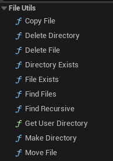

浙江移动项目

请先放置大文件

大文件详情请见BigFiles/BigFile.txt

相关技术详解：

## 一、重置模型坐标轴


有时我们导入到UE的模型坐标轴可能不在模型中心，而是在一个很远的地方，这种情况我们在使用模型时会出现很多不便，所以需要将模型的坐标中重置到模型中心，这个操作其实不需要返工到建模阶段去重置，其实UE自身就提供了这个功能。

方法就是切换UE的编辑器的编辑模式到模型编辑模式：


然后在Mode Toolbar视窗中选择Transform栏的Pivot选项，选择之后，到Modeling选项卡，点击Center按钮。


然后点击场景视图中的Accept应用变换，坐标轴就可以被重置到模型中心了：


这时我们再将编辑器切回选项模型，就可以看到坐标轴已经被重置到模型中心了：


## 二、只获取目录下的一级子目录

对于下面这样的目录结构，如我们只想获取根目录下的一级子目录，有下面三种方法:

```
Test
|----Test1
|	|----SubTest1
|	|____Test1.txt
|----Test2
|	|----SubTest2
|	|____Test2.txt
|----Test3.txt
|____Test4.md
```

### 1.UE提供的C++函数

UE提供了两个函数来读取目录和文件，分别是

```c++
// 函数1：
IFileManager::Get().FindFiles(TArray<FString>& FoundFiles, const TCHAR* Directory, const TCHAR* FileExtension = nullptr)
// 函数2：
IFileManager::Get().FindFiles( TArray<FString>& FileNames, const TCHAR* Filename, bool Files, bool Directories)
```

和

```c++
// 函数3：
IFileManager::Get().FindFilesRecursive( TArray<FString>& FileNames, const TCHAR* StartDirectory, const TCHAR* Filename, bool Files, bool Directories, bool bClearFileNames=true)
```

函数1只能查找Directory目录下的文件并且不会搜寻其子目录，可以使用FileExtension参数控制要查找文件类型，如：`IFileManager::Get().FindFiles(SubFiles,*Dir,TEXT("*.txt"))`，那么查找到文件如下：

```
Test3.txt
```

函数3是递归的查找目录下的所有文件，包括所有子目录下的文件，且也可以使用Filename参数控制要查找的文件类型，可以使用Files，Directories两个函数来控制只查找文件或只查找目录，或者两者都查找如：`IFileManager::Get().FindFilesRecursive(SubFiles,*Dir,TEXT("*.*"),true,true)`，那么查找的文件如下：

```
E:\Test\Test1
E:\Test\Test2
E:\Test\Test3.txt
E:\Test\Text4.md
E:\Test\Test1\SubTest1
E:\Test\Test1\Test1.txt
E:\Test\Test2\SubTest2
E:\Test\Test2\Test2.txt
```

而我们要搜索一级子目录，则只能使用函数2，如：`IFileManager::Get().FindFiles(SubFiles,*Dir,false,true)`，那么查找到目录如下：

```
Test1
Test2
```

这里有一点是需要注意的，对于函数1和函数3我们输入的目录都是`E:\Test`，而函数2不能使用这个路径，否则查询到目录是`Test`，对于函数2，需要输入路劲1`E:\Test\*`，才能查找到Test目录下的一级子目录。

对于文件操作，UE官方还封装好了蓝图函数，我们需要启动插件`Blueprint File Utilities`即可使用封装好的蓝图，不过这个插件的功能十分优先，对于搜索一级子目录这种定制化的需求还是需要自己写C++代码。



### 2.使用C++11提供的函数

```c++
std::vector<std::string> GetAllSubdirectories(const std::string& Dir)
{
	std::vector<std::string> Dirs;
	long long hFile = 0;
	_wfinddata_t FileInfo;
	std::wstring_convert<std::codecvt_utf8<wchar_t>> Conv;
	std::wstring RootPath = Conv.from_bytes(Dir);
	std::wstring WPath = RootPath + L"\\*";
	if ((hFile = _wfindfirst(WPath.c_str(), &FileInfo)) != -1)
	{
		do
		{
			if(FileInfo.attrib & _A_SUBDIR && wcscmp(FileInfo.name,L".") != 0 && wcscmp(FileInfo.name,L"..") != 0)
			{
				std::wstring SubPath = RootPath + L"/" + FileInfo.name;
				const wchar_t* DirNameChr = SubPath.c_str();
                  std::string DirNameStr = Conv.to_bytes(DirNameChr)
				Dirs.push_back(DirNameStr);
			}
		}
		while(_wfindnext(hFile,&FileInfo) == 0);
		_findclose(hFile);
	}
	return Dirs;
}
```

UE提供的函数默认已经适配了中文路径，而C++的`std::string`和`_findfirst`默认不适配中文路径，所以这里改用了`std::wstring`和`_wfindfirst`，可以使用`_wfinddata_t::attrib`属性与`_A_SUBDIR`宏做与运算来筛选子目录，也可以使用或运算来组合多个属性筛选，除了`_A_SUBDIR`宏外，C++11还提供如下宏

```c++
_A_ARCH		//（存档）
_A_HIDDEN	//（隐藏）
_A_NORMAL	//（正常）
_A_RDONLY	//（只读）
_A_SUBDIR	//（文件夹）
_A_SYSTEM	//（系统）
```

`_wfindfirst`函数会把系统隐藏目录`.`和`..`目录都搜索出来，我们还需要自行将这两个目录排除。

同时，和UE函数一样，在给`_wfindfirst`函数提供搜索目录时也需要在目录的后面加上`\*`。